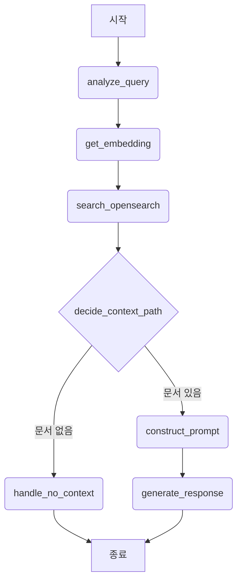
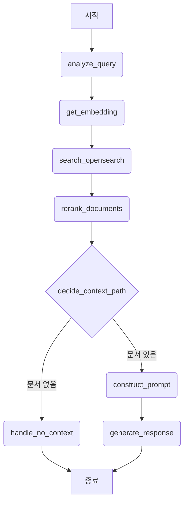

# LangGraph 기반 RAG 파이프라인 아키텍처 설계

## 1. 개요

이 문서는 기존의 단일 Lambda 함수로 구현된 RAG (Retrieval-Augmented Generation) 파이프라인을 `LangGraph` 라이브러리를 사용하여 모듈화된 아키텍처로 재설계하는 방안을 기술합니다. 이 새로운 설계는 각 기능 단위를 독립적인 '노드(Node)'로 분리하여 파이프라인의 유연성, 확장성, 및 유지보수성을 크게 향상시키는 것을 목표로 합니다.

## 2. 핵심 구성 요소

### 2.1. 그래프 상태 (Graph State)

파이프라인의 모든 노드는 중앙 상태 객체(State)를 통해 데이터를 공유하고 업데이트합니다. `TypedDict`로 정의될 상태는 다음과 같은 필드를 가집니다.

-   `query` (str): 사용자가 입력한 원본 질문.
-   `scenario` (str): 사용자의 질문 의도를 분석하여 결정된 시나리오 (예: 'general', 'specification', 'greeting').
-   `embedding` (List[float]): `query`를 벡터로 변환한 임베딩 값.
-   `context_chunks` (List[dict]): OpenSearch에서 검색된 관련 문서 조각의 목록.
-   `prompt` (str): 검색된 컨텍스트와 쿼리를 조합하여 생성된 최종 LLM 프롬프트.
-   `generation` (str): LLM이 최종적으로 생성한 답변.

### 2.2. 노드 (Nodes)

각 노드는 파이프라인의 특정 단계를 수행하는 Python 함수입니다.

| 노드 이름             | 역할                                                                                     | 입력 (from State)               | 출력 (to State)    |
| --------------------- | ---------------------------------------------------------------------------------------- | ------------------------------- | ------------------ |
| `analyze_query`       | 사용자 질문의 의도를 분석하여 `scenario`를 결정합니다.                                 | `query`                         | `scenario`         |
| `get_embedding`       | 사용자 질문을 받아 임베딩 벡터를 생성합니다.                                           | `query`                         | `embedding`        |
| `search_opensearch`   | 임베딩 벡터를 사용하여 OpenSearch에서 관련 문서를 검색합니다.                             | `embedding`                     | `context_chunks`   |
| `decide_context_path` | 검색된 문서의 존재 여부에 따라 다음 단계를 결정하는 분기 노드입니다.                    | `context_chunks`                | (다음 노드 결정)   |
| `construct_prompt`    | `scenario`에 맞는 프롬프트 템플릿을 선택하고, 검색된 문서와 조합하여 최종 프롬프트를 생성합니다. | `query`, `context_chunks`, `scenario` | `prompt`           |
| `generate_response`   | 생성된 프롬프트를 기반으로 Bedrock LLM을 호출하여 답변을 생성합니다.                      | `prompt`                        | `generation`       |
| `handle_no_context`   | 검색된 문서가 없을 경우, 고정된 안내 메시지를 생성합니다.                                | -                               | `generation`       |

### 2.3. 그래프 흐름 (Graph Flow)

노드들은 다음과 같은 순서와 조건에 따라 연결되어 전체 RAG 파이프라인을 형성합니다.

## 3. 확장성

이 모듈식 아키텍처는 향후 파이프라인을 고도화할 때 큰 이점을 제공합니다. 이번에 추가된 `analyze_query` 노드가 바로 그 좋은 예시입니다.

### 구현된 확장 예시: 동적 프롬프트 선택

-   **`analyze_query` (쿼리 의도 분석)**: 파이프라인의 시작점에서 사용자의 질문을 LLM으로 분석하여 '일반 질의', '스펙 조회', '인사' 등 시나리오를 동적으로 결정합니다.
-   **`construct_prompt` (동적 프롬프트 적용)**: `analyze_query`가 결정한 `scenario`에 따라, 가장 적합한 프롬프트 템플릿을 선택하여 적용합니다. 이를 통해 각 상황에 최적화된 답변 생성을 유도할 수 있습니다.

### 향후 확장 방향: 문서 리랭킹

-   **`rerank_documents` (문서 리랭킹)**: `search_opensearch`가 가져온 여러 문서들을 단순히 사용하는 것을 넘어, 질문과의 관련도를 다시 한번 정밀하게 계산하여 순서를 재조정하는 `rerank_documents` 노드를 `decide_context_path` 앞에 추가할 수 있습니다. 이를 통해 LLM에 더 정확한 컨텍스트를 제공하여 답변의 질을 높일 수 있습니다.

